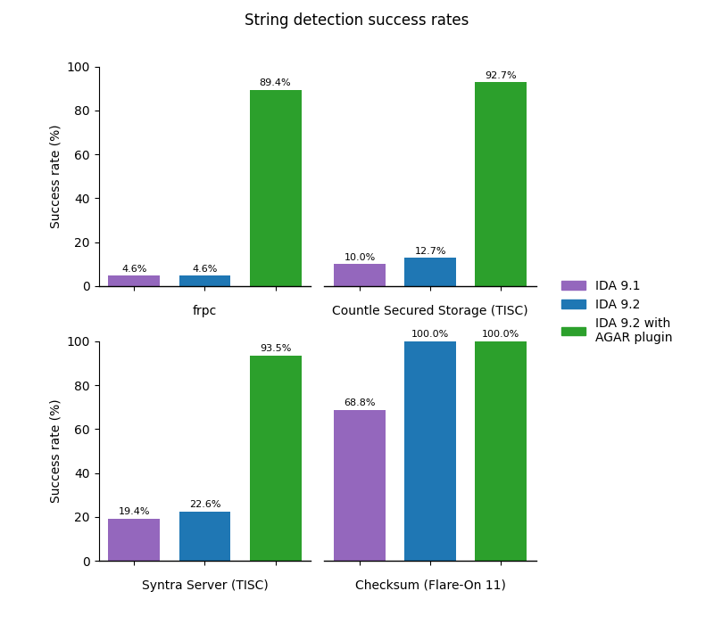
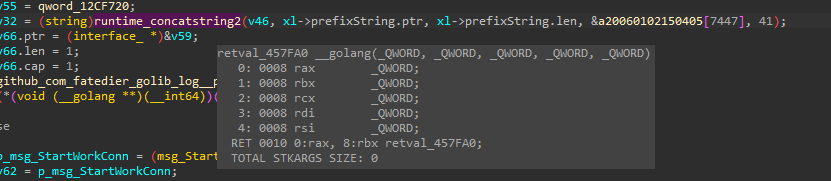
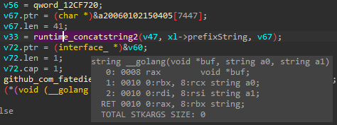
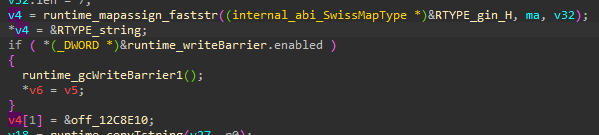
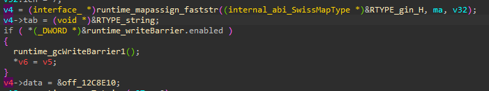
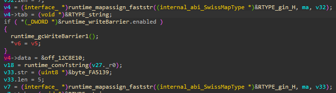
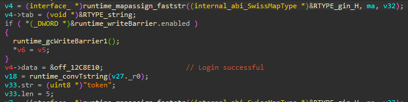
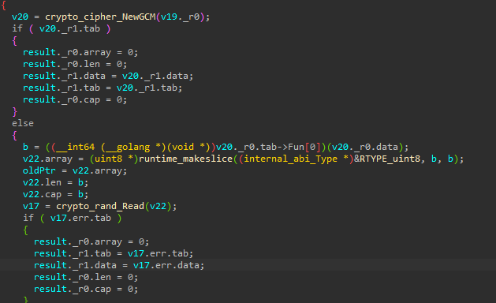
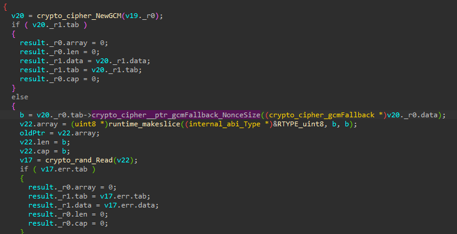

# AGAR

Assisting Go Analysis and Reversing (AGAR) correctly detects **5 to 20x more strings** in Go programs compiled for Linux than standalone IDA 9.2.

You can also use AGAR to **demystify method calls** on interface types.

As it relies on the function's AST and type information, AGAR may not work on stripped or obfuscated Go binaries (see [tests](#tests)).

## Benchmarks

Tested on
- [frpc](https://github.com/fatedier/frp/tree/dev/client) (compiled for Linux)
- Two Go RE CTF challenges from [TISC 2025](https://www.csit.gov.sg/events/tisc/tisc-2025)
- Checksum from Flare-On 11

You can read the test evaluation script [here](./evaluation/string_evaluation_worker.py).
It runs the following scripts in sequence:
1. Function retyper
2. Slice rebuilder
3. Interface rebuilder
4. String detector

## Usage
### String/interface/slice detection and rebuilding

https://github.com/user-attachments/assets/8d7ef373-4f73-42c9-bffb-7add26cc0e84

1. Press `Ctrl + Shift + G` or select `AGAR` from the plugins menu.
2. Specify the scope AGAR should work on. Note that each function in scope will be decompiled multiple times, so running analysis on all functions will take some time.
3. Click `OK` to run AGAR

### Interface specializer

https://github.com/user-attachments/assets/bd63b071-17d3-4c91-b564-5846baa02c67

1. Right click on the interface type (struct field or local variable) and select "Specialize interface"
2. Select the appropriate concrete implementation from the dropdown

## Installation

Copy the contents of `src` to the IDA Plugins directory.

## Features

### Standard Library Function retyper

**Before:**  

**After:**  

### Interface detection and retyping
**Before:**  

**After:**  

### String detection
**Before:**  

**After:**  

### Interface specializer

**Before:**  

**After:**  

## Tests

The [test](test) directory contains Go programs and Python scripts to assess AGAR's ability to analyze these programs when compiled to a variety of architectures.

Currently, there are 6 known failing tests:
- interface_detection-main/arm: Failure
- aes_gcm/amd64_stripped: Failure
- aes_gcm/windows_amd64: Failure
- itab_typedef_2/amd64_stripped: Failure
- itab_typedef_1/amd64_stripped: Failure
- itab_typedef_1/windows_amd64: Failure

This is primarily due to lack of type information in stripped binaries or binaries compiled for Windows.

To run the tests, 
1. Build the test binaries: `py build.py`
2. Run the tests: `py runner.py`

You will need IDA 9.2 with `idalib` configured.
